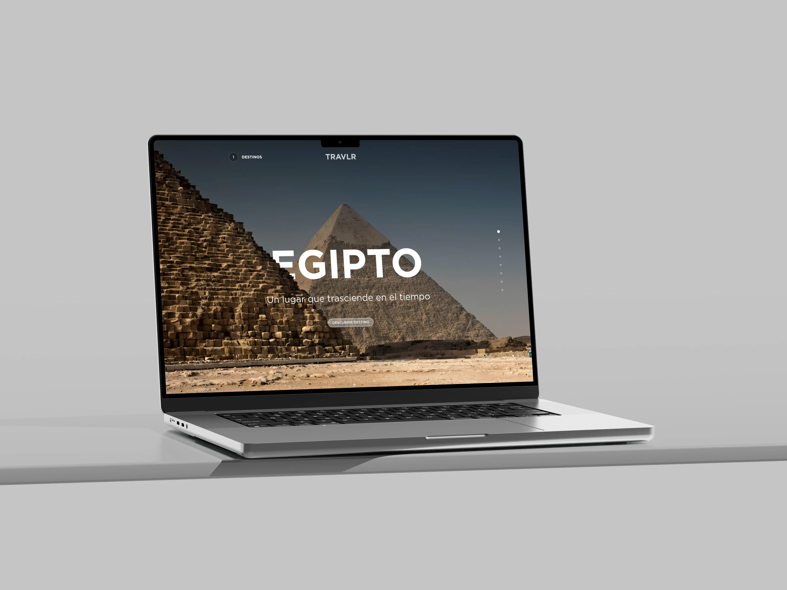
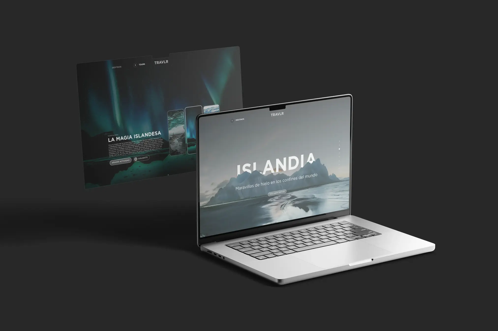
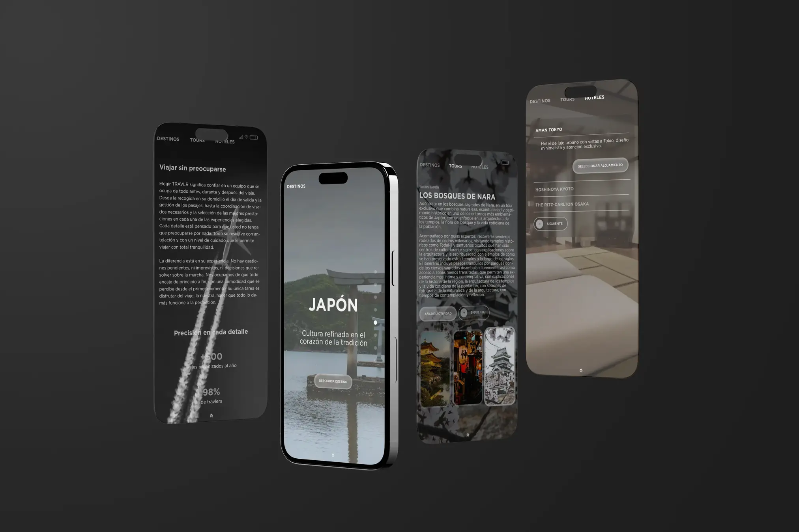

# TRAVLR

## Descripción 📑
TRAVLR es una web para una agencia de viajes premium.
Se trata de un proyecto de maquetación hecha con HTML5, CSS3 y JavaScript.
La idea principal era crear una agencia organizadora de viajes con una página muy sencilla de usar, basando toda la navegación del usuario en el siguiente proceso o flujo:
1. Se elige el destino deseado
2. Se añaden tours vinculados a ese destino
3. Se escoge un hotel de alojamiento
4. Se establecen datos del viaje
5. Se finaliza el proceso de compra.

La aplicación trae la mayoría de la información desde archivos JSON locales y va actualizando el carrito de forma que el usuario conserva su selección entre páginas.

## ¿Qué he aprendido en este proyecto? 🙇🏻
- Estructuración jerárquica y semántica del contenido HTML utilizando la metodología SuitCSS.
- Uso de custom properties en CSS para mantener coherencia visual en tipografías, colores, etc.
- Adaptación del diseño a distintos tamaños de dispositivos móvil, tablet y ordenador para asegurar la correcta visualización.
- Carga nativa de fuentes usando @font-face para que sea visible en todos los dispositivos y optimizar los tiempos de carga.
- Optimización de elementos visuales (imágenes y fondos) para equilibrio entre calidad y rendimiento.
- Desarrollo de documentos JSON para crear contenido dinámico en la interfaz.
- Uso mejorado y optimización de herramientas de Inteligencia Artificial aplicada a entornos de trabajo de programación / maquetación.
- 

## Tecnologías 🛠

## Vista previa del proyecto
Si quieres echar un vistazo rápido al diseño:

## Estructura del proyecto

- `index.html`: slider selector de destinos de viaje.
- `tours.html`: tours disponibles en cada país.
- `hoteles.html`: selección de hoteles del país a elegir.
- `reserva.html`: checkout final y pasarela de pago.
- `header.html` / `footer.html`: web components común en toda la web.
- `sobre-nosotros.html`: página más enfocada a textos e info.
- `contacto.html`: típica página con formulario de contacto.
- /css/: estilos por vista y estilos globales.
- /js/: lógica por página + núcleo compartido.
- /assets/: recursos y elementos utilizados en el proyecto (imgs y fuentes)
- /data/: archivos .json con información de cada país (rutas de img, tours, textos, hoteles, precios...).

## Autor ✒️
**Alexx Burt**

- [LinkedIn](https://www.linkedin.com/in/alexxburt/)
- [Portfolio](https://alexxburt.framer.website/)